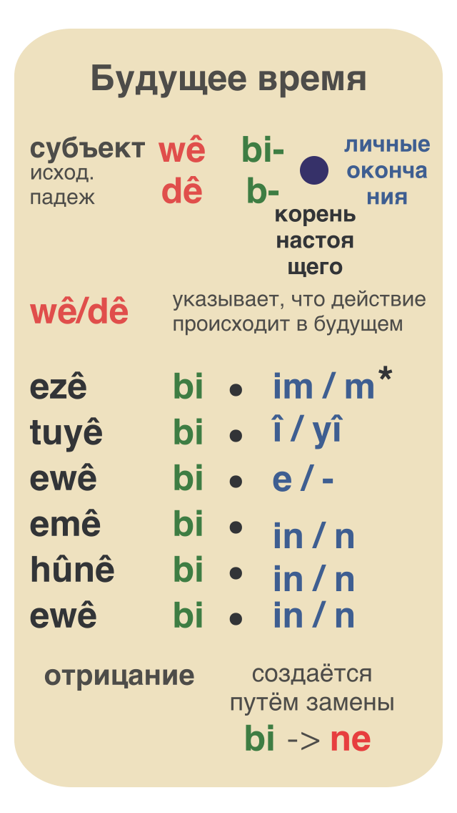

# Глаголы будущее

Если субъект это местоимение, то окончание ê (к примеру: ez**ê**) указывает, что действие происходит в будущем.

Если субъект не местоимение, то на будущее указывает **wê** или **dê** (в зависимости от диалекта).

Примеры:

|||
|-|-|
|Di cenetê de jiyan wê gelek xweş be|В раю жизнь очень хорошей будет|