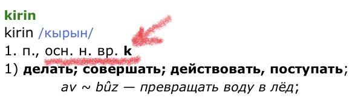
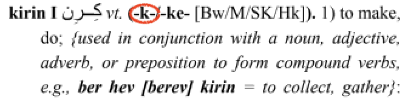
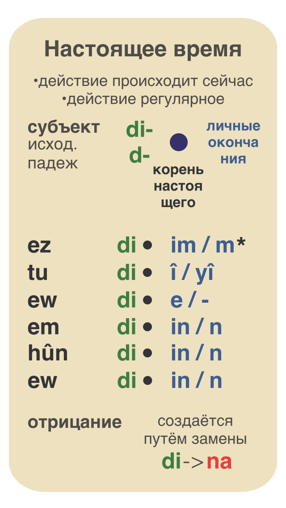

# Глаголы (настоящее)

Глаголы имеют два корня:

- **корень** для прошедших времен;
- **корень** для настоящего, будущего и повелительного наклонения.

Корень прошедшего берем из инфинитива (исходная форма глагола в словаре).

**kir\***in\* - делать

**kir** - корень прошедшего

_in_ - окончание которое отбрасывается

Корень настоящего обычно записан в скобках.

kirin в словаре kurdonline.ru

kirin в словаре Ferhenga Birûskî Kurmanji

## Настоящее время (сейчас и вообще)

＊ - если корень заканчивается на гласную

