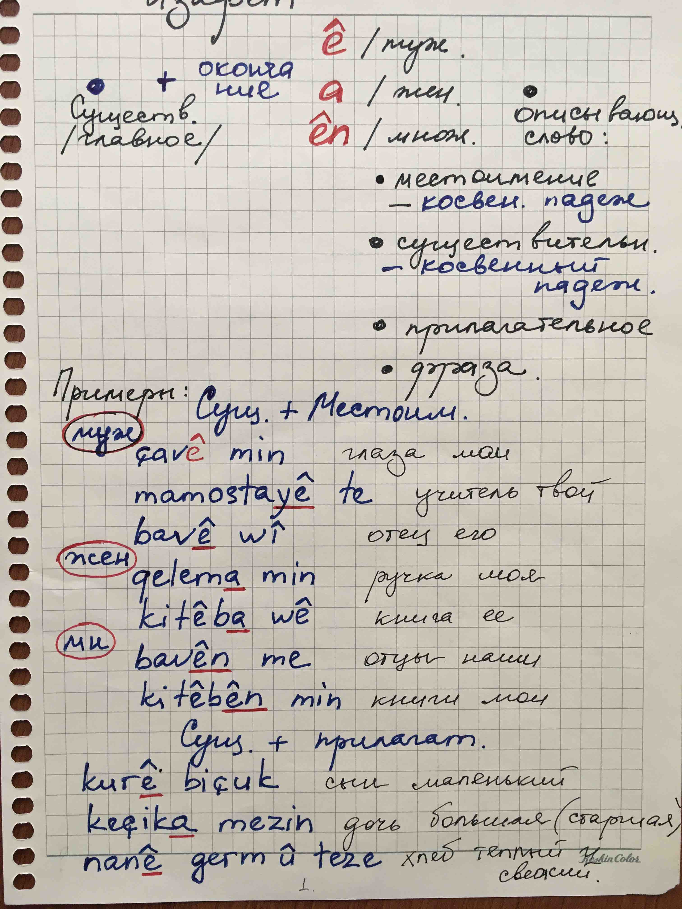
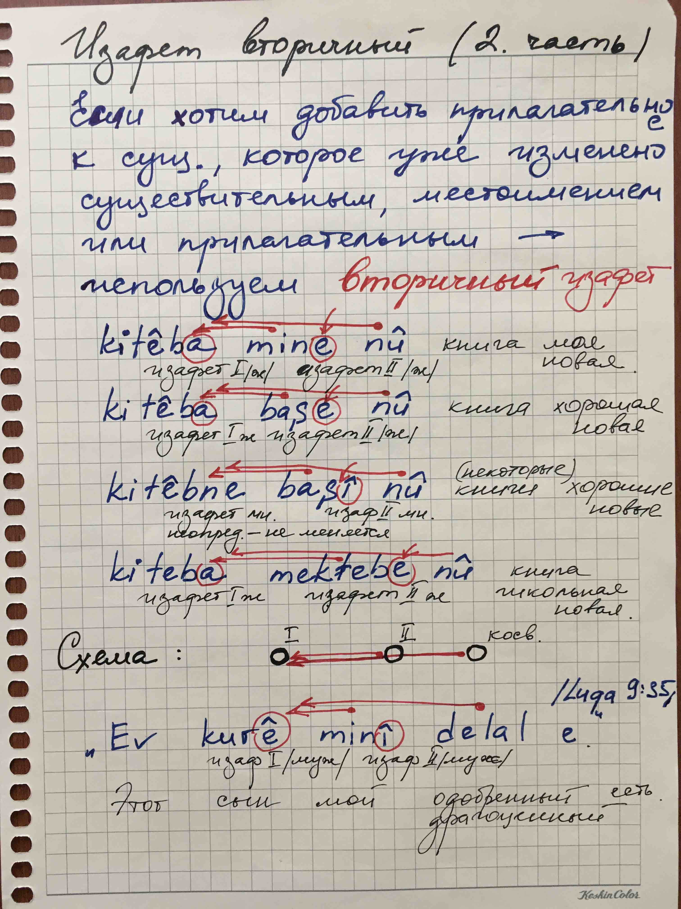
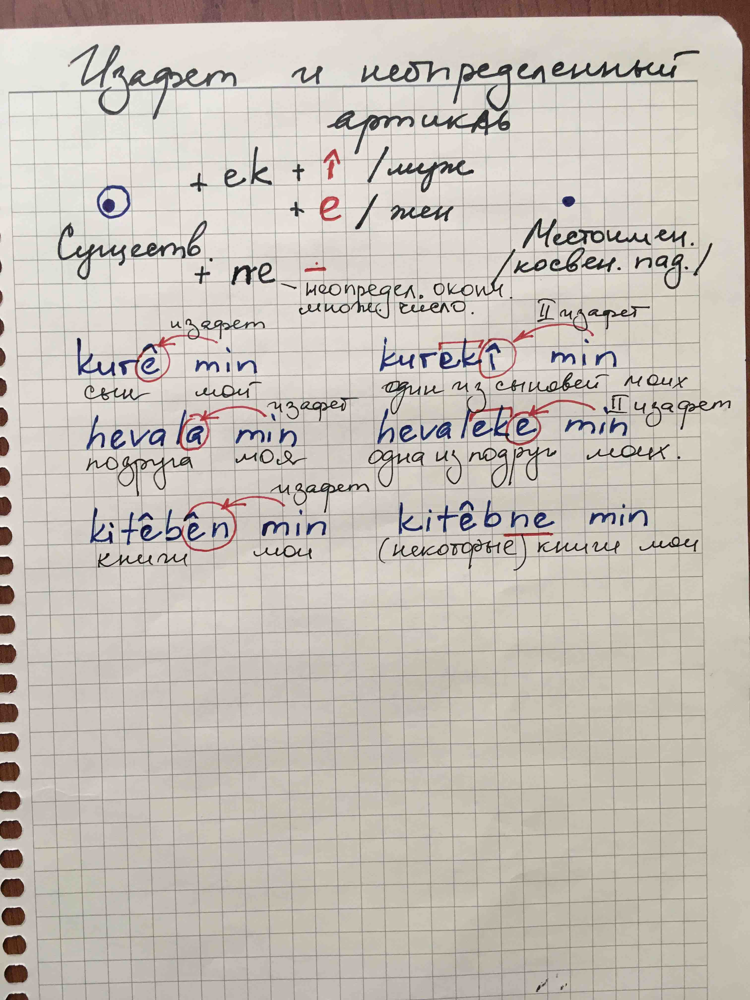

# Изафетные цепи

## Примеры

| | |
|-|-|
|Большой красивый цветок.|Kulîka mezin û bedew.|
|Моя новая книга.|Kitêba min a nû. Kitêba mine nû.|
|Красивая молодая девушка.|Jineke ciwan û bedew.|
|Твой старый друг.|Hevalê te yê pîr.|
|Его правая рука.|Destê wî yê rast.|
|Новый молодой брат.|Birayê nû û ciwan.|
|Новая книга брата.|Kitêba nû ya bira.|
|Сытый чёрный кот.|Pişîka reş û têr.|
|Большой серый осел.|Kerê mezin û gewr.|
|Друг дочери.|Hevalê keçê.|
|Отец друга дочери моей.|Bavê hevalê keça min.|
|Самая близкая подруга.|Hevala herî nêzîk.|
|Маленький голодный мальчик.|Kurê biçûk û birçî.|
|Новый друг моего брата.|Hevalê nû yê birayê min.|
|Младший сын одного из моих друзей.|Kurê biçûk ê hevalekî min.|
|Новый дом который купил мой брат.|Mala nû ya ku birayê min kirî.|
|Мой старый дом далеко.|Mala min a pîr dûr e.|
|Это мой большой и красивый дом.|Ev mala min a mezin û bedew e.|
|Этот большой и красивый дом - мой.|Ev mala mezin û bedew a min e.|
|Мой дом большой и красивый.|Mala min mezin û bedew e.|