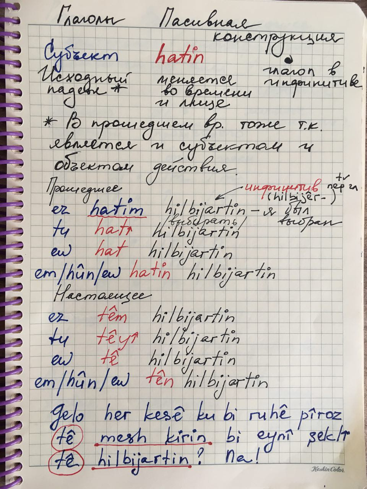
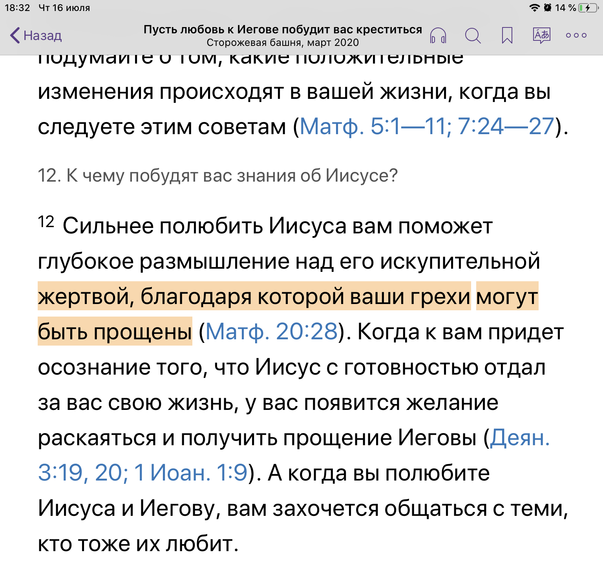
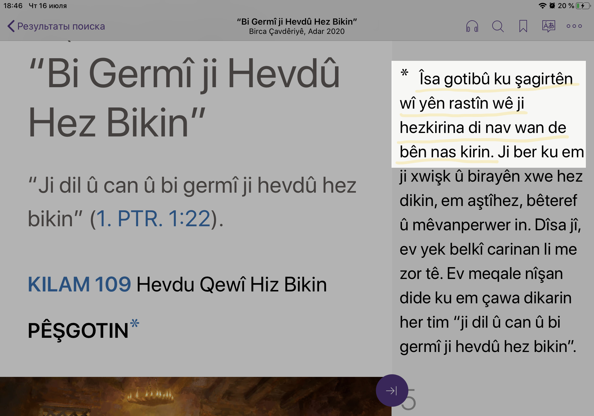

# Пассивный залог

## Примеры

|                                    |                                    |
| ---------------------------------- | ---------------------------------- |
|  |  |

|                                    |                                                                            |
| ---------------------------------- | -------------------------------------------------------------------------- |
|  | Иисус говорил, что ученики его истинные буду по любви между ними узнаваемы |

