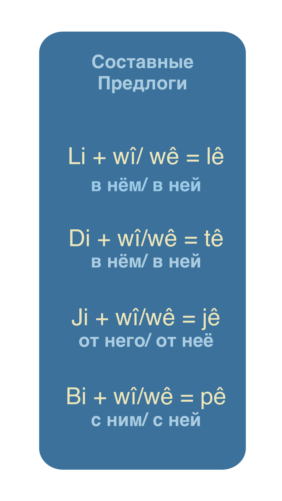

# Составные предлоги

## jê

|фраза|перевод|
|-|-|
|Himmler ew nas kir û ... jê (ji wî) pirs kir|Гимлер его узнал и у него спросил|
|Birayê me jê re (ji wî re) got|Брат наш ему сказал|

## tê

|фраза|перевод|
|-|-|
|Lêkolîna Kitêba Pîroz û pêxemberiyên ku tê de (di wê de) hene ...|Изучение Библии и пророчеств которые в ней есть ...|

## pê

|фраза|перевод|
|-|-|
|gerek kalên civatê ... pê (bi wî) eleqedar bibin|нужно старейшинам собрания с ним связь иметь|

### Примечание
**ji ... pê ve - кроме (за исключением)**

|фраза|перевод|
|-|-|
|ji Şandiyan pê ve hemû...|кроме апостолов все...|

**ji ... pê ve - впредь, отныне, после этого**

|фраза|перевод|
|-|-|
|Ji wexta ku civata Şagirtên Îsa hatibû saz kirin û pê ve...|От времени, что собрание учеников Иисуса было создано и после...|